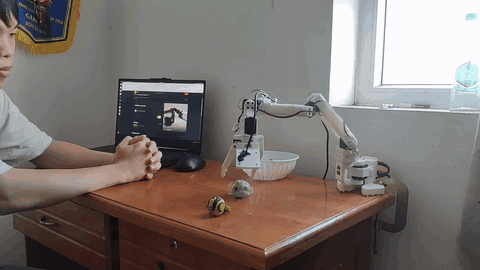

# vizhoang.vercel.app

Personal portfolio for **Hoang Quoc Viet** — a builder working across AI, data, software,
automation and physical systems.

Live at **[vizhoang.vercel.app](https://vizhoang.vercel.app)**.



*Mira: a spoken request becomes an LLM tool call becomes arm motion. [Full demo](https://www.youtube.com/watch?v=rNHOZqLiyZs).*

## What this is

A single-page React site. Project content lives in one file, [`constants.ts`](constants.ts),
as three typed arrays — `PROJECTS`, `CERTIFICATIONS`, `ACCOMPLISHMENTS`. Adding or editing a
project means editing that file; nothing else needs to change. Each project gets a generated
case-study route at `/project/:id`.

## Stack

| Concern | Choice |
|---|---|
| UI | React 19, TypeScript |
| Build | Vite 7 |
| Routing | React Router 7 |
| Animation | Framer Motion |
| Icons | Lucide |
| Styling | Hand-written CSS in [`index.css`](index.css), no framework |
| Dev server | Express wrapper in [`server.ts`](server.ts) around Vite middleware |
| Hosting | Vercel |

Theme is light/dark via a `data-theme` attribute on `<html>`, persisted to `localStorage`
and defaulting to the operating system preference.

## Running it

No environment variables and no API keys are required. The site is fully static.

```bash
npm install
npm run dev
```

That serves on `http://localhost:3000`. Other scripts:

| Script | Does |
|---|---|
| `npm run build` | Production build into `build/` |
| `npm run preview` | Serve the built output |
| `npm run typecheck` | `tsc --noEmit` |

## Layout

```
App.tsx            shell, header, theme toggle, routes
constants.ts       all project / certification / award content
types.ts           shapes for the above
index.css          the entire stylesheet
components/        Home, ProjectCard, ProjectDetail, Certifications,
                   Accomplishments, MediaLightbox, TypingHero, Footer
lib/media.ts       collects a project's media into a lightbox-ready list
public/            images, video, posters, certificate PDFs
```

## Editing content

Add an object to `PROJECTS` in [`constants.ts`](constants.ts). Only `id`, `title`,
`shortDescription`, `fullDescription`, `tags` and `features` are required. Set
`featured: true` to promote it to a large card on the home page — featured cards need
either an `imageUrl` or a `previewVideoUrl`, since they are media-led. Projects without
media render as text rows under "More projects and research" and still get a full
case-study page.

Media conventions in `public/`: a `.webp` still for layout, an optional muted `.mp4`
loop for cards, and a matching `-poster.webp` so nothing pops in on load.

## A note on the content

Figures on this site are measured figures. Where something was attempted and did not work
— MolmoAct2 rejected at 1.18x signal-to-noise, grasping incomplete on the edge build,
smolVLA never run because the rig has two cameras and it wants three — the site says so
rather than omitting it. If you find a claim here that outruns its evidence, that is a bug;
please tell me.

## Licence

Code is free to borrow. Text, images and video are not — they are a record of specific
work by a specific person.
